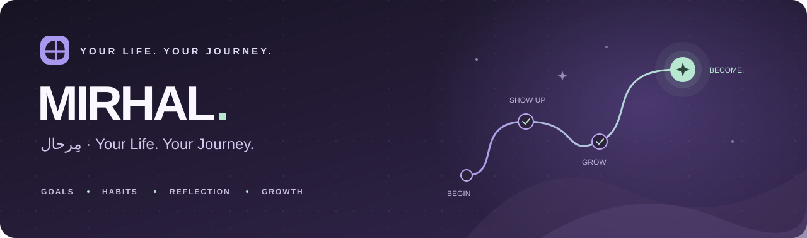
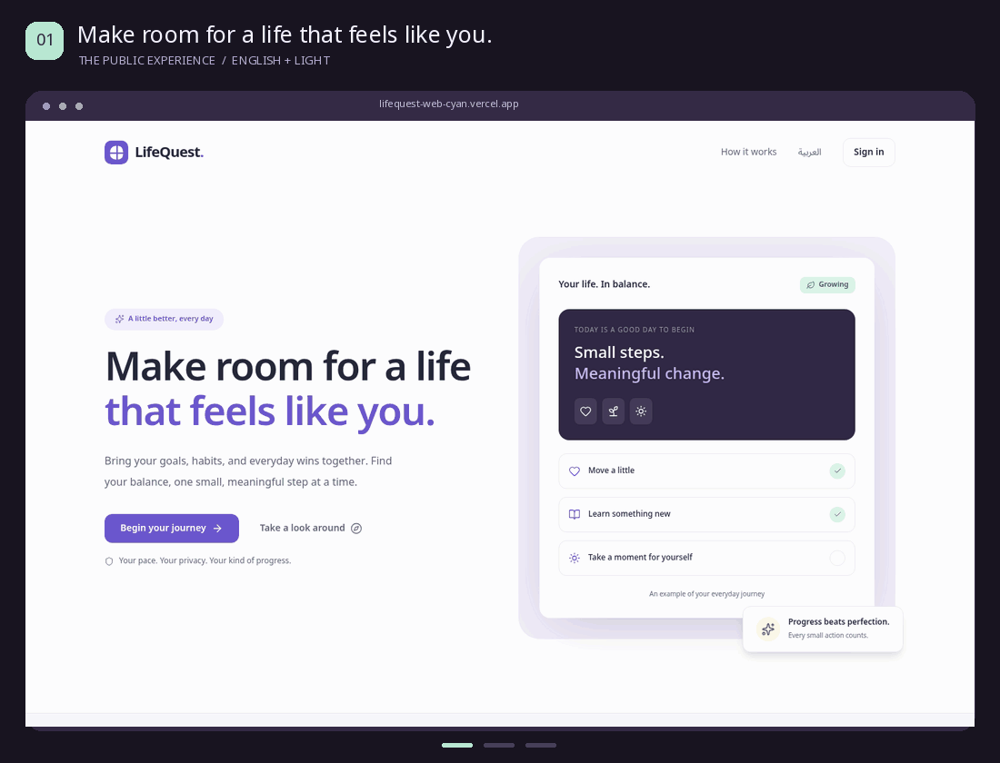
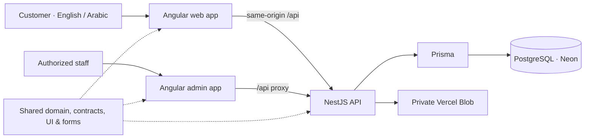

<div align="center">



<h3>مِرحال · Your Life. Your Journey.</h3>

Bring your goals, habits, and everyday wins together.<br />
Build a life that feels like you, one meaningful step at a time.

<p>
  <a href="https://lifequest-web-cyan.vercel.app"></a>
  <a href="https://lifequest-admin.vercel.app"></a>
  <a href="docs/architecture/overview.md"></a>
</p>

[](https://github.com/Ahmed-elssamman/LifeQuest/actions/workflows/ci.yml)


[The experience](#the-experience) · [Quick start](#quick-start) · [Architecture](#architecture) · [Deployment](#deployment) · [Documentation](#documentation)

</div>

---

## Small steps, made visible

MIRHAL — مِرحال is a bilingual personal growth platform that connects long-term goals with the things you do today. Plan meaningful work, build sustainable habits, reflect on your progress, and celebrate the small wins with quests, XP, achievements, and rewards.

It includes a customer app, a separate administration app, and a shared API. English and Arabic, right-to-left layouts, light and dark themes, and responsive navigation are built into the experience.

<div align="center">
  
  <p><sub>Archived captures from before the MIRHAL rebrand. <a href="docs/media/landing.png">Static English preview</a> · <a href="docs/media/arabic-dark.png">Arabic / dark preview</a> · <a href="docs/media/mobile.png">Mobile preview</a></sub></p>
</div>

## The experience

|                                   | Make space for what matters                                                                                                  |
| --------------------------------- | ---------------------------------------------------------------------------------------------------------------------------- |
| 🎯 **A direction for your day**   | Link goals, milestones, projects, tasks, and subtasks. Set priorities and dates, then choose your next step in Today.        |
| 🌱 **Habits that fit real life**  | Daily, weekly, and custom schedules; minimum actions; streaks; and Habit Lab experiments for getting back on track.          |
| ✨ **Progress worth celebrating** | Weekly quests, server-calculated XP, levels, achievements, personal rewards, savings goals and gentle level-up celebrations. |
| 📖 **Room to reflect**            | Daily check-ins, a monthly journey, and analytics help you see the story behind your progress.                               |
| 🤝 **A little shared momentum**   | Friendships and private challenges with deterministic scoring and explicit sharing controls.                                 |
| 🛡️ **Care behind the scenes**     | A role-protected admin portal for support, moderation, catalogs, quest templates, insights, and audit logs.                  |

### Thoughtful by design

- **English & العربية** — switch language with full RTL layouts and saved preferences.
- **Light, dark, or system** — consistent themes across customer and admin experiences.
- **Desktop to pocket** — responsive layouts, mobile navigation, and installable PWA support.
- **Accessible interactions** — keyboard navigation, associated form errors, reduced motion, and unsaved-edit protection.
- **Private progress** — HttpOnly session cookies, private feedback attachments, and server-authoritative rewards. Offline caching covers static assets; private API data stays off the cache.

> **Release status:** the MIRHAL phases are verified locally and have not been deployed. The query-index, attachment-cleanup and reward-preference migrations must accompany the next reviewed release. The linked live sites still run the previous release. See the [migration plan](docs/implementation/mirhal-migration-plan.md).

> **Existing live deployment:** registration and sign-in are available. Email delivery is currently disabled, so verification and password recovery emails are unavailable. The admin portal requires an authorized staff account.

## Quick start

Use **Node.js 22.12+** (Node 24 is used on Vercel), **npm**, and **PostgreSQL**. Keep the lockfile and install with `npm ci`.

```bash
git clone https://github.com/Ahmed-elssamman/LifeQuest.git
cd LifeQuest
npm ci
cp -n .env.example .env
```

Set `DATABASE_URL` and `DIRECT_URL` in `.env` to your intended PostgreSQL runtime and migration connections. Verify the migration target before running the following commands:

```bash
npm run db:generate
npm run db:deploy
npm run db:seed
npm run dev
```

| Application          | Local address                                             | Start separately    |
| -------------------- | --------------------------------------------------------- | ------------------- |
| Customer             | [localhost:4200](http://localhost:4200)                   | `npm run dev:web`   |
| Administration       | [localhost:4201](http://localhost:4201)                   | `npm run dev:admin` |
| API                  | [localhost:3333/api](http://localhost:3333/api)           | `npm run dev:api`   |
| Development API docs | [localhost:3333/api/docs](http://localhost:3333/api/docs) | Served by the API   |

The seed creates reference data. To create development accounts, set the optional `DEMO_EMAIL` / `DEMO_PASSWORD` and `DEMO_ADMIN_EMAIL` / `DEMO_ADMIN_PASSWORD` pairs before seeding. No account passwords are published in this repository.

<details>
<summary><strong>Environment and local services</strong></summary>

`.env.example` documents the configuration. `.env` stays private and is ignored by Git.

| Setting                                     | Purpose                                                                                                                                   |
| ------------------------------------------- | ----------------------------------------------------------------------------------------------------------------------------------------- |
| `DATABASE_URL` / `DIRECT_URL`               | Runtime and migration connections. With Neon, use a pooled runtime URL and a direct migration URL. These never belong in browser bundles. |
| `TEST_DATABASE_URL`                         | A dedicated **local** database ending in `_test`. Integration tests reset it; E2E resets its separate `lifequest_e2e_test` database.      |
| `WEB_ORIGIN` / `ADMIN_ORIGIN` / `APP_URL`   | Allowed browser origins and links in email.                                                                                               |
| `PORT` / `SSR_ALLOWED_HOSTS`                | API port and explicit public SSR host allowlist.                                                                                          |
| `MAIL_MODE` / `SMTP_*`                      | Local development messages, disabled delivery, or configured production SMTP. Development links stay in `.local/mail/`.                   |
| `UPLOAD_DIR`                                | Local private feedback storage, defaulting to `.local/uploads`. Non-Vercel production requires persistent storage.                        |
| `VERCEL_WEB_ORIGIN` / `VERCEL_ADMIN_ORIGIN` | Production aliases used by the Vercel packaging and configuration scripts.                                                                |
| `BLOB_READ_WRITE_TOKEN` / `CRON_SECRET`     | Private Vercel storage and scheduled-maintenance credentials.                                                                             |

With PostgreSQL binaries on your PATH, `npm run db:local` provisions isolated local databases without replacing existing Neon configuration. See the [database guide](docs/architecture/database.md) for details.

</details>

## Architecture



| Layer        | Technology                                                                                      |
| ------------ | ----------------------------------------------------------------------------------------------- |
| Frontend     | Angular 21, signals, lazy routes, public prerendering, Tailwind CSS 4, PrimeNG 21, Lucide icons |
| Backend      | NestJS 11, Express 5, Zod validation, Argon2id, opaque cookie sessions                          |
| Data         | Prisma 6, PostgreSQL, versioned SQL migrations, deterministic reference seeds                   |
| Workspace    | Nx 22, strict TypeScript 5.9, shared domain and UI libraries                                    |
| Verification | Vitest, Angular/jsdom, Supertest, Playwright, axe, ESLint, Prettier                             |
| Hosting      | Vercel web/API project, separate admin project, Neon database, private Blob storage             |

```text
LifeQuest/
├── apps/
│   ├── web/           Customer experience
│   ├── admin/         Staff operations
│   └── api/           Authentication, planning, progression & social API
├── libs/              Shared domain, contracts, UI, forms & data access
├── prisma/            Schema, SQL migrations & seed data
├── tests/             Domain, integration & browser tests
├── tools/             Local services, verification & Vercel packaging
└── docs/              Architecture, product decisions & visual previews
```

Angular 21 and PrimeNG 21 use supported peer ranges without Angular peer overrides. The compatibility decision is documented in [ADR 001](docs/decisions/001-stack-compatibility.md).

## Quality checks

The [GitHub Actions workflow](.github/workflows/ci.yml) runs formatting, source-safety checks, linting, type checks, unit and integration tests, production builds, SSR checks, and browser tests.

```bash
npm ls --all
npm audit --audit-level=high
npm run format:check
npm run security:check
npm run lint
npm run typecheck
npm run test:coverage
npm run test:frontend
npm run test:integration -- --coverage
npm run db:validate
npm run db:check-migrations
npm run build
npm run test:ssr
npx playwright install chromium
npm run test:e2e
npm run test:performance
```

Integration and E2E checks require the isolated local test database described above. E2E serves production builds on ports 4300/4301 with its test API on 3433. Domain and API coverage thresholds are 80% statements/functions/lines and 70% branches. See the [28 September audit](docs/audit/final-audit.md) for current measured coverage, tested workflows, and limitations. The performance command uses disposable fixtures in the local test database and must run after a build, separately from integration tests.

## Deployment

| Live application        | Address                                                                    |
| ----------------------- | -------------------------------------------------------------------------- |
| Customer frontend + API | **[lifequest-web-cyan.vercel.app](https://lifequest-web-cyan.vercel.app)** |
| Administration frontend | **[lifequest-admin.vercel.app](https://lifequest-admin.vercel.app)**       |

The customer project serves prerendered public pages, client-rendered private routes, and the NestJS API as a Vercel function. The admin project serves its own frontend and proxies API calls to the customer origin.

After linking both projects and configuring the database, production aliases, and private Blob store as described in the [deployment guide](docs/architecture/vercel.md):

```bash
npm run db:generate
npm run db:deploy
npm run vercel:configure
npm run vercel:package
vercel deploy --prebuilt --prod --yes --cwd .local/vercel/web
vercel deploy --prebuilt --prod --yes --cwd .local/vercel/admin
npm run vercel:verify
```

Deployments use Vercel's Build Output API v3. The repository's CI validates changes; production releases use the explicit deployment commands above. Do not import the monorepo with Vercel's default build settings without configuring this packaging workflow.

<details>
<summary><strong>Self-hosting</strong></summary>

`npm run build` produces `dist/web`, `dist/admin`, and `dist/api`.

- Start the API with `node dist/api/apps/api/src/main.js`.
- Start the public SSR server with `node dist/web/server/server.mjs` (`WEB_PORT`, default 4000).
- Serve `dist/admin/browser` with SPA fallback.
- Route `/api/*` on both application origins to the API through a TLS reverse proxy.
- Revalidate public HTML, cache hashed assets immutably, and keep API responses uncached.

Development proxies and the E2E server are not production servers. Configure persistent private upload storage and production email delivery for your environment.

</details>

## Documentation

| Explore                      | Guide                                                                                                                                                                                       |
| ---------------------------- | ------------------------------------------------------------------------------------------------------------------------------------------------------------------------------------------- |
| How the system fits together | [Architecture overview](docs/architecture/overview.md) · [Frontend](docs/architecture/frontend.md) · [Backend](docs/architecture/backend.md)                                                |
| How progress works           | [Domain model](docs/product/domain-model.md) · [Gamification](docs/product/gamification.md) · [Challenges](docs/product/challenges.md) · [Personalization](docs/product/personalization.md) |
| Data and privacy             | [Database](docs/architecture/database.md) · [Privacy](docs/product/privacy.md) · [API](docs/api/README.md)                                                                                  |
| Verification and operations  | [Testing](docs/architecture/testing.md) · [Latest audit](docs/audit/final-audit.md) · [Historical verification](docs/architecture/verification.md) · [Vercel](docs/architecture/vercel.md)  |
| Decisions and current scope  | [Compatibility ADR](docs/decisions/001-stack-compatibility.md) · [Implementation record](docs/IMPLEMENTATION.md)                                                                            |
| MIRHAL migration             | [Baseline](docs/audit/baseline.md) · [Incremental plan](docs/implementation/mirhal-migration-plan.md)                                                                                       |
| Future health boundary       | [Health integration architecture](docs/architecture/health-integrations.md)                                                                                                                 |
| Refresh the README visuals   | [Media sources and generation](docs/media/README.md)                                                                                                                                        |

---

<div align="center">
  <strong>Progress beats perfection.</strong><br />
  <sub>Every small action counts. · كل خطوة صغيرة تُحسب.</sub><br /><br />
  <a href="https://lifequest-web-cyan.vercel.app">Begin your journey →</a>
</div>
