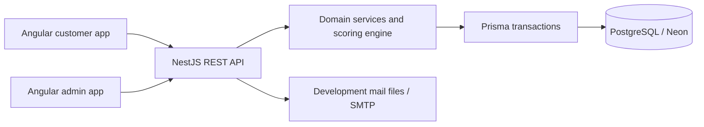

# Architecture

LifeQuest is a modular monolith in an Nx npm workspace. Customer and administration bundles are separate Angular applications. They share reusable UI, form, authentication, preference and HTTP primitives; operational code is not imported by the customer app.

The NestJS API owns authorization and domain writes. Prisma is the schema source of truth. PostgreSQL foreign keys, unique constraints, checks and triggers reinforce application validation. Neon credentials remain on the server.

Each major frontend feature is lazy loaded. Public landing and help pages prerender; private routes are client-rendered behind session guards. Heavy operational tables and the analytics visualization remain in lazy chunks. Static PWA caching excludes APIs and queued writes.

Backend domains: identity, account/planning, habits/reflection/quests, gamification, social and administration. Services own multi-record transactions. REST controllers validate external DTOs with shared strict Zod schemas. OpenAPI request schemas derive from those same validators. Dependency injection is explicit with `@Inject`; unnecessary generated design-type metadata is disabled in production and tests.

Sensitive operations lock rows in a documented order. Habit/task/quest/reward operations lock the user before changing XP. Challenge activation/finalization locks the challenge, then participating users in sorted order. Account erasure takes challenge locks before its user lock. Do not introduce a reverse lock order.

See the individual frontend/backend/database/testing documents for extension points and constraints. The implementation record tracks unfinished acceptance work rather than treating a passing build as completion.
